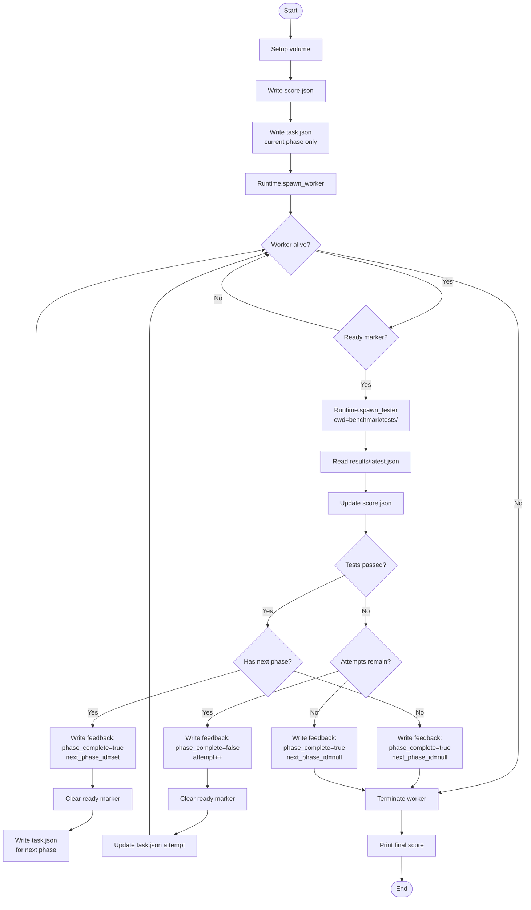

# Manager Lifecycle

This document describes the state machine of the CAE manager component.

## Architecture

```
┌─────────────┐     spawn      ┌──────────┐
│   Manager   │───────────────▶│  Worker  │
│             │                │ (agent)  │
│  state      │◀── feedback───│          │
│  machine    │                └──────────┘
│             │
│   ┌─────────┴─────────┐
│   │  ready marker     │
│   └───────────────────┘
│             │
│   ┌─────────┴──────────────┐
│   │  Runtime abstraction   │  ←─ local: subprocess
│   │                        │     container: Podman (stubbed)
│   └────────────────────────┘
│             │
│   ┌─────────┴──────────────┐
│   │  Tester (isolated)     │  ←─ cwd = benchmark/tests/
│   │  reads benchmark spec  │      reads agent artifacts from volume
│   │  reads fixtures        │      writes results/latest.json
│   └────────────────────────┘
└─────────────┘
```

**Tests are never copied into the worker volume.** The tester receives the
benchmark path and runs with `cwd` set to the benchmark's tests directory so
relative fixture paths resolve correctly. The agent cannot see tests or
fixtures.

**Runtime is abstracted.** The manager accepts a ``Runtime`` object and never
cares whether it's local subprocesses or containers.  When container mode is
implemented, only :mod:`cae.runtime` changes — manager code stays untouched.

## State Machine



## Decision Table

| Tests | Attempts | Action | Next State |
|---|---|---|---|
| Pass | Has next phase | Advance | Poll (new phase, attempt=1) |
| Pass | Last phase | Done (success) | Cleanup |
| Fail | `< max_attempts` | Retry | Poll (same phase, attempt+1) |
| Fail | `>= max_attempts` | Done (failure) | Cleanup |

**Critical:** On exhaustion, the benchmark ends immediately. The agent does **not**
receive the prompt for the next phase.

## Volume State

```
volume/
  .cae/
    task.json          ← manager writes, worker reads
    feedback.json      ← manager writes, worker reads
    score.json         ← manager writes, worker reads
    ready              ← worker creates, manager consumes
    results/
      latest.json      ← tester writes, manager reads
  # everything else is agent workspace
```

- **Manager writes:** `task.json`, `feedback.json`, `score.json`
- **Worker writes:** `ready` marker
- **Tester writes:** `results/latest.json`
- **Worker reads:** `task.json`, `feedback.json`
- **Tester reads:** `results/` output (agent artifacts)

## Runtime Interface

```python
class Runtime(ABC):
    def spawn_worker(self, volume, agent_cmd=None) -> Popen
    def spawn_tester(self, volume, benchmark, phase_id) -> CompletedProcess
```

| Implementation | spawn_worker | spawn_tester |
|---|---|---|
| ``LocalRuntime`` | ``subprocess.Popen([python, -m, cae.worker, ...])`` | ``subprocess.run([python, -m, cae.tester, ...], cwd=tests/)`` |
| ``ContainerRuntime`` | ``podman run ... cae-worker`` (stubbed) | ``podman run ... cae-tester`` (stubbed) |

## Worker Loop

```
while true:
    task = read task.json
    if no task: sleep, continue

    run_agent(task.prompt, cwd=volume.root)
    write ready marker

    feedback = read feedback.json
    while no new feedback:
        sleep
        feedback = read feedback.json

    if feedback.phase_complete:
        if feedback.next_phase_id is null:
            break              # benchmark done
        else:
            continue           # new task.json already written
    else:
        continue               # retry: task.json already updated
```

## Multi-Benchmark Orchestration

A single manager run evaluates **one benchmark** (one task group with N phases).
Multi-benchmark evaluation is a thin wrapper:

```python
for benchmark in benchmarks:
    volume = fresh_volume(benchmark.id)
    runtime = runtime_for_mode(mode)
    score = run_group(benchmark, volume, runtime, ...)
    persist(benchmark.id, score)
```

Each benchmark gets a **fresh volume** and **fresh runtime**. The agent starts
from scratch for every group.

## Filesystem Layout (no tests in volume)

```
benchmarks/
  nlm-eval/
    task.json
    prompts/
    tests/
      run.sh           ← tester executes this
      fixtures/        ← tester reads these (relative to tests/)

# volume is ONLY agent workspace + .cae/ protocol files
/tmp/cae-volume-42/
  .cae/
  # agent writes code here
```
